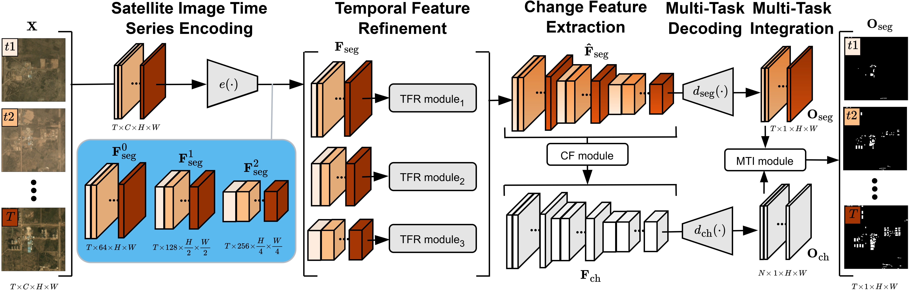

# Continuous Urban Change Detection from Satellite Image Time Series

This repository contains the official code for the following paper:

S. Hafner, H. Fang, H. Azizpour and Y. Ban, "Continuous Urban Change Detection from Satellite Image Time Series with Temporal Feature Refinement and Multi-Task Integration," *(accepted to TGRS)*.

[](https://arxiv.org/abs/2406.17458)





# Setup

This section shows you how to setup the dataset and the virtual environment.

## Dataset

The SpaceNet 7 dataset is available from this [link](https://spacenet.ai/sn7-challenge/). More information can be found in the [SpaceNet 7 dataset paper](https://openaccess.thecvf.com/content/CVPR2021/html/Van_Etten_The_Multi-Temporal_Urban_Development_SpaceNet_Dataset_CVPR_2021_paper.html).

We use a metadata file (`metadata_conturbancd.json`) that can be downloaded from [here](https://drive.google.com/file/d/1wzRZ9iS2lOu24OArkG5n5tQaNrRQ6As6/view?usp=drive_link) or from this repository. The metadata file should be placed in the root directory of the SpaceNet 7 dataset (see below). 

We also generated raster labels using the code in [this paper](https://doi.org/10.1109/IGARSS46834.2022.9883982). The labels can be obtained from [this link](https://drive.google.com/file/d/1ZHcZ0qfcymBJ4_hHcpDz6UpwvOiRZccB/view?usp=sharing) and should be placed in the respective study site folder.

The dataset directory should look like this:

```
$ SpaceNet 7 dataset directory
spacenet7  # -d should point to this directory
├── metadata_conturbancd.json  # Download this file and place it in the dataset directory
└── train
    ├── L15-0331E-1257N_1327_3160_13
    ...
    └── L15-1848E-0793N_7394_5018_13
        ├── images_masked
        ├── labels
        └── labels_raster  # Generated using the vector data in labels
```


## Environment

1. Clone this repository

    ```bash
    git clone https://github.com/SebastianHafner/ContUrbanCD.git
    cd ContUrbanCD
    ```

2. Setup a virtual environment

    We use conda to setup the environment:
    ```bash
    conda create -n conturbancd python=3.9.7
    conda activate conturbancd
   ```

3. Install the dependencies
    
    Install pytorch according to the [official guide](https://pytorch.org/get-started/locally/).
    
    Install other dependencies using the `requirements.txt` file. Note that not all libraries specified in the file are required to run this code.
    ```bash
    pip install -r requirements.txt
   ```


# Running our code

This section provides all the instructions to run our code. If you do not want to train your own models, we also provide [our model weights](https://drive.google.com/drive/folders/1GA4_GM4li-K8gpCltFjM0x0W46k7iol5?usp=sharing) (trained using this code base).

All scripts (`train.py`, `evaluation.py`, `inference.py`) require three arguments:
- The config file is specified using `-c`. This repo includes dataset-specific configs for the proposed method. 
- The output directory is specified using `-o`. We use this directory to store model weights and evaluation and inference outputs.
- The dataset directory is specified using `-d`. This directory points to the root folder of the dataset.


## Training

To train our network on SpaceNet 7, run the following script:
 ```bash
 python train.py -c conturbancd_sn7 -o output -d spacenet7
 ```


## Evaluation

To calculate the evaluation metrics, run this script:
 ```bash
 python eval.py -c conturbancd_sn7 -o output -d spacenet7
 ```

The script outputs a `.json` file containing accuracy values.


## Inference

To produce multi-temporal building segmentation outputs from a satellite image time series, run the following script:

 ```bash
 python inference.py -c conturbancd_sn7 -o output -d spacenet7
 ```

Note: You have the option to set the edge setting in the MRF module using `-e` (degenerate, adjacent, cyclic, and dense). Dense is used as default option.

The resulting file (`.np`) is of dimension T x H x W with the first dimension denoting the temporal dimension.

```python
seg_sits = np.load(output_file)  # T x H x X

# Building segmentations for second image in the time series
seg_img_t2 = seg_sits[1]

# Changes between first and last images of the time series
ch_first_last = np.not_equal(seg_sits[0], seg_sits[-1])
```

# Credits

If you find this work useful, please consider citing:


  ```bibtex
@article{hafner2024continuous,
  title={Continuous Urban Change Detection from Satellite Image Time Series with Temporal Feature Refinement and Multi-Task Integration},
  author={Hafner, Sebastian and Fang, Heng and Azizpour, Hossein and Ban, Yifang},
  journal={arXiv preprint arXiv:2406.17458},
  year={2024}
}
  ```
  